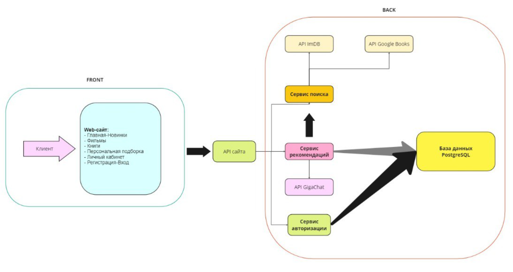

# Веб-сервис для рекомендаций фильмов

Этот проект представляет собой веб-приложение для просмотра и поиска фильмов и книг с использованием ИИ для рекомендаций.

## Основные функции

1. Просмотр списка фильмов и книг
2. Поиск фильмов и книг по ключевым словам, жанрам, странам, создателям, годам и возрастным рейтингам
3. Получение рекомендаций на основе предпочтений пользователя и истории просмотров с использованием ИИ
4. Возможность добавления фильмов и книг в избранное и отметка просмотренных
5. Поддержка аутентификации и регистрации пользователей

## Установка и настройка

1. Клонируйте репозиторий проекта.
2. Убедитесь, что у вас установлены Python и все необходимые зависимости из requirements.txt
3. Создайте и настройте файл `.env` на основе файла `.env.example`, указав все необходимые параметры.
4. Выполните миграции базы данных с помощью команды `python manage.py migrate`.
5. Запустите сервер с помощью команды `python manage.py runserver`.

## Структура проекта

- `api`: содержит представления и сериализаторы для API
- `web`: содержит представления и шаблоны для веб-интерфейса
- `user`: содержит модели и функции для работы с пользователями
- `utils`: содержит вспомогательные функции для работы с фильмами и книгами
- `movies`: содержит настройки Django для проекта

## Используемые технологии

- Python
- Django
- PostgreSQL
- ИИ для рекомендаций
- DeepLX API для перевода

## Алгоритм подборки

1. Получает параметры запроса, такие как тип медиа, ключевые слова, жанр, страну, создателя, год и возрастной рейтинг.
2. Выбирает фильмы или книги из списка избранного и просмотренных пользователем при необходимости.
3. Создает текстовый запрос (промпт) для AI, включая предпочтения пользователя, избранные и последние просмотренные фильмы или книги.
4. Отправляет запрос к AI-сервису с использованием API, передавая промпт и ожидая ответ с рекомендациями.
5. Если ответ успешен, разбирает рекомендации и ищет соответствующие фильмы или книги в базе данных или создает их, если они еще не существуют.
6. Возвращает список рекомендованных фильмов или книг в формате JSON.

## Архитектура

